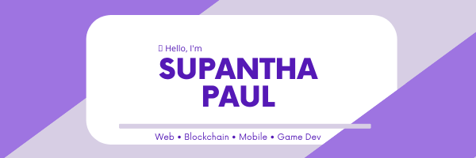

<!-- Social badges -->
<!--  -->

Heya visitor! 👋

I'm a full-stack web developer who also loves making games. Currently getting my feet wet in data science and machine learning. Also interested in digital art and anything technology!

## ✍ Latest Blog Posts

<!-- BLOG-POST-LIST:START -->
- [Getting Started with FastAPI - Create APIs Quickly using Python](https://dev.to/supanthapaul/getting-started-with-fastapi-create-apis-quickly-using-python-2a9f)
- [Create a Simple Navbar with 7 Lines of CSS](https://dev.to/supanthapaul/create-a-simple-navbar-with-7-lines-of-css-4h7f)
- [How to choose your first front-end framework without losing your mind](https://dev.to/supanthapaul/how-to-choose-your-first-front-end-framework-without-losing-your-mind-1eee)
<!-- BLOG-POST-LIST:END -->

<!-- Pinned Repositories -->

## 📌 Pinned Repositories

 
 

 
 

 
 

<!-- GitHub Stats -->

## 📈 GitHub Stats

## 💼 Skills

 

 

